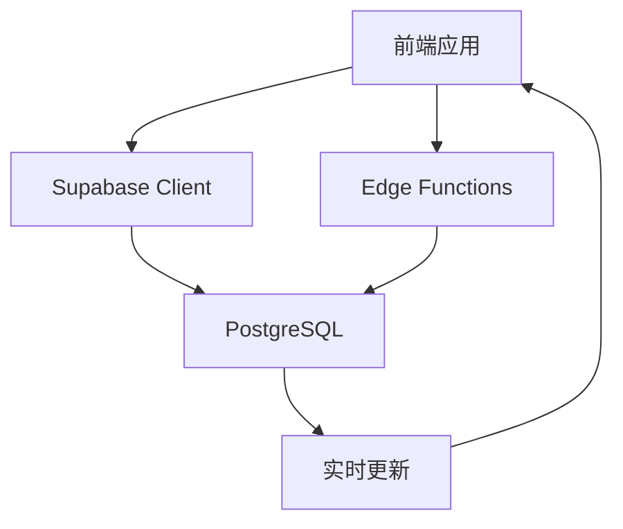

# Supabase 数据层性能优化与扩展性分析

## 📊 **当前架构分析**

### 现有数据架构
```
Supabase PostgreSQL
├── render_pages (核心表)
├── render_profiles (用户资料)
├── Edge Functions (4个)
│   ├── get-share
│   ├── create-share
│   ├── save-draft
│   └── publish-draft
└── Client-side queries (直接查询)
```

### 数据流分析


## 🔍 **性能问题识别**

### 1. **查询性能问题**

#### Gallery页面查询
```sql
-- 当前查询 (性能问题)
SELECT 
  id, title, description, code_type, view_count, share_count, created_at,
  render_profiles!inner(display_name)
FROM render_pages
WHERE status = 'published'
ORDER BY created_at DESC;
```

**问题分析**:
- ❌ **JOIN操作昂贵**: `render_profiles!inner` 导致每行都需要JOIN
- ❌ **缺少索引**: `status + created_at` 组合查询未优化
- ❌ **全表扫描**: 没有分页，可能返回大量数据
- ❌ **N+1问题**: 每个项目都需要查询用户信息

#### 建议优化
```sql
-- 优化后查询
SELECT 
  rp.id, rp.title, rp.description, rp.code_type, 
  rp.view_count, rp.share_count, rp.created_at,
  prof.display_name
FROM render_pages rp
LEFT JOIN render_profiles prof ON rp.user_id = prof.id
WHERE rp.status = 'published'
ORDER BY rp.created_at DESC
LIMIT 20 OFFSET 0;

-- 添加复合索引
CREATE INDEX idx_render_pages_status_created 
ON render_pages(status, created_at DESC);
```

### 2. **Edge Functions 性能问题**

#### get-share函数分析
```typescript
// 当前实现问题
const { data, error } = await supabase
  .from('render_pages')
  .select('*')  // ❌ 选择所有字段
  .eq('id', id)
  .single();

// 然后立即更新
await supabase
  .from('render_pages')
  .update({ view_count: (data.view_count || 0) + 1 })  // ❌ 原子性问题
  .eq('id', id);
```

**问题**:
- ❌ **过度查询**: `select('*')` 返回不必要的数据
- ❌ **竞态条件**: view_count更新可能丢失
- ❌ **两次数据库访问**: 读取后再更新

## 🚀 **性能优化方案**

### 1. **数据库层优化**

#### 索引策略
```sql
-- 创建关键索引
CREATE INDEX CONCURRENTLY idx_render_pages_status_created 
ON render_pages(status, created_at DESC) 
WHERE status = 'published';

CREATE INDEX CONCURRENTLY idx_render_pages_user_status 
ON render_pages(user_id, status) 
WHERE status IN ('draft', 'published');

CREATE INDEX CONCURRENTLY idx_render_pages_code_type 
ON render_pages(code_type) 
WHERE status = 'published';

-- 全文搜索索引
CREATE INDEX CONCURRENTLY idx_render_pages_search 
ON render_pages USING GIN(to_tsvector('english', title || ' ' || description));
```

#### 视图优化
```sql
-- 创建物化视图用于Gallery
CREATE MATERIALIZED VIEW gallery_view AS
SELECT 
  rp.id, rp.title, rp.description, rp.code_type,
  rp.view_count, rp.share_count, rp.created_at,
  prof.display_name
FROM render_pages rp
LEFT JOIN render_profiles prof ON rp.user_id = prof.id
WHERE rp.status = 'published'
ORDER BY rp.created_at DESC;

-- 设置自动刷新
CREATE OR REPLACE FUNCTION refresh_gallery_view()
RETURNS TRIGGER AS $$
BEGIN
  REFRESH MATERIALIZED VIEW CONCURRENTLY gallery_view;
  RETURN NULL;
END;
$$ LANGUAGE plpgsql;

CREATE TRIGGER refresh_gallery_trigger
AFTER INSERT OR UPDATE OR DELETE ON render_pages
FOR EACH STATEMENT
EXECUTE FUNCTION refresh_gallery_view();
```

### 2. **Edge Functions 优化**

#### 优化后的 get-share 函数
```typescript
import { serve } from "https://deno.land/std@0.168.0/http/server.ts"
import { createClient } from 'https://esm.sh/@supabase/supabase-js@2'

// 使用 Redis 缓存
import { Redis } from "https://deno.land/x/redis@v0.29.0/mod.ts";

const redis = new Redis({
  hostname: Deno.env.get('REDIS_HOST'),
  port: parseInt(Deno.env.get('REDIS_PORT') || '6379'),
});

serve(async (req) => {
  try {
    const { id, password } = await req.json();
    
    // 1. 缓存检查
    const cacheKey = `share:${id}`;
    const cached = await redis.get(cacheKey);
    if (cached && !password) {
      const data = JSON.parse(cached);
      // 异步更新浏览次数
      updateViewCountAsync(id);
      return new Response(JSON.stringify({ success: true, data }));
    }
    
    // 2. 优化的数据库查询
    const supabase = createClient(
      Deno.env.get('SUPABASE_URL')!,
      Deno.env.get('SUPABASE_SERVICE_ROLE_KEY')!
    );
    
    const { data, error } = await supabase
      .from('render_pages')
      .select('id, title, description, html_content, code_type, is_protected, password, view_count')
      .eq('id', id)
      .single();
      
    if (error || !data) {
      throw new Error('Share not found');
    }
    
    // 3. 密码验证
    if (data.is_protected && data.password !== password) {
      return new Response(JSON.stringify({ 
        success: false, 
        requiresPassword: !password,
        error: password ? 'Incorrect password' : 'Password required'
      }), { status: password ? 401 : 200 });
    }
    
    // 4. 原子性更新浏览次数
    await supabase
      .rpc('increment_view_count', { page_id: id });
    
    // 5. 准备返回数据
    const shareData = {
      id: data.id,
      content: data.html_content,
      title: data.title,
      description: data.description,
      codeType: data.code_type,
      isProtected: data.is_protected,
      createdAt: Date.now()
    };
    
    // 6. 缓存结果（如果不受密码保护）
    if (!data.is_protected) {
      await redis.setex(cacheKey, 300, JSON.stringify(shareData)); // 5分钟缓存
    }
    
    return new Response(JSON.stringify({ success: true, data: shareData }));
    
  } catch (error) {
    return new Response(JSON.stringify({ 
      success: false, 
      error: error.message 
    }), { status: 500 });
  }
});

// 异步更新浏览次数
async function updateViewCountAsync(id: string) {
  try {
    const supabase = createClient(
      Deno.env.get('SUPABASE_URL')!,
      Deno.env.get('SUPABASE_SERVICE_ROLE_KEY')!
    );
    await supabase.rpc('increment_view_count', { page_id: id });
  } catch (error) {
    console.error('Failed to update view count:', error);
  }
}
```

#### 数据库函数优化
```sql
-- 创建原子性操作函数
CREATE OR REPLACE FUNCTION increment_view_count(page_id UUID)
RETURNS INTEGER AS $$
DECLARE
  new_count INTEGER;
BEGIN
  UPDATE render_pages 
  SET view_count = view_count + 1
  WHERE id = page_id
  RETURNING view_count INTO new_count;
  
  RETURN new_count;
END;
$$ LANGUAGE plpgsql;

-- 批量操作函数
CREATE OR REPLACE FUNCTION get_gallery_pages(
  limit_count INTEGER DEFAULT 20,
  offset_count INTEGER DEFAULT 0,
  filter_type TEXT DEFAULT NULL
)
RETURNS TABLE(
  id UUID,
  title TEXT,
  description TEXT,
  code_type TEXT,
  view_count INTEGER,
  share_count INTEGER,
  created_at TIMESTAMP,
  author_name TEXT
) AS $$
BEGIN
  RETURN QUERY
  SELECT 
    rp.id, rp.title, rp.description, rp.code_type,
    rp.view_count, rp.share_count, rp.created_at,
    COALESCE(prof.display_name, '匿名用户') as author_name
  FROM render_pages rp
  LEFT JOIN render_profiles prof ON rp.user_id = prof.id
  WHERE rp.status = 'published'
    AND (filter_type IS NULL OR rp.code_type = filter_type)
  ORDER BY rp.created_at DESC
  LIMIT limit_count OFFSET offset_count;
END;
$$ LANGUAGE plpgsql;
```

### 3. **客户端优化**

#### 数据获取策略
```typescript
// 创建优化的数据服务
export class DataService {
  private cache = new Map<string, { data: any; timestamp: number }>();
  private readonly CACHE_TTL = 5 * 60 * 1000; // 5分钟

  async getGalleryPages(
    page: number = 1, 
    pageSize: number = 20, 
    filter?: string
  ) {
    const cacheKey = `gallery:${page}:${pageSize}:${filter || 'all'}`;
    
    // 检查缓存
    const cached = this.cache.get(cacheKey);
    if (cached && Date.now() - cached.timestamp < this.CACHE_TTL) {
      return cached.data;
    }
    
    // 使用数据库函数
    const { data, error } = await supabase
      .rpc('get_gallery_pages', {
        limit_count: pageSize,
        offset_count: (page - 1) * pageSize,
        filter_type: filter === 'all' ? null : filter
      });
      
    if (error) throw error;
    
    // 缓存结果
    this.cache.set(cacheKey, { data, timestamp: Date.now() });
    
    return data;
  }
  
  // 预加载下一页
  async prefetchNextPage(currentPage: number, pageSize: number, filter?: string) {
    setTimeout(() => {
      this.getGalleryPages(currentPage + 1, pageSize, filter);
    }, 1000);
  }
}
```

## 🔧 **扩展性方案**

### 1. **多数据库支持架构**

#### 数据抽象层
```typescript
// 创建数据库抽象接口
interface DatabaseAdapter {
  query<T>(sql: string, params?: any[]): Promise<T[]>;
  insert<T>(table: string, data: Partial<T>): Promise<T>;
  update<T>(table: string, id: string, data: Partial<T>): Promise<T>;
  delete(table: string, id: string): Promise<boolean>;
}

// Supabase适配器
class SupabaseAdapter implements DatabaseAdapter {
  constructor(private client: SupabaseClient) {}
  
  async query<T>(sql: string, params?: any[]): Promise<T[]> {
    const { data, error } = await this.client.rpc('execute_sql', { 
      sql, params 
    });
    if (error) throw error;
    return data;
  }
  
  async insert<T>(table: string, data: Partial<T>): Promise<T> {
    const { data: result, error } = await this.client
      .from(table)
      .insert(data)
      .select()
      .single();
    if (error) throw error;
    return result;
  }
  
  // ... 其他方法实现
}

// MySQL适配器
class MySQLAdapter implements DatabaseAdapter {
  constructor(private pool: mysql.Pool) {}
  
  async query<T>(sql: string, params?: any[]): Promise<T[]> {
    return new Promise((resolve, reject) => {
      this.pool.execute(sql, params, (error, results) => {
        if (error) reject(error);
        else resolve(results as T[]);
      });
    });
  }
  
  async insert<T>(table: string, data: Partial<T>): Promise<T> {
    const keys = Object.keys(data);
    const values = Object.values(data);
    const placeholders = keys.map(() => '?').join(', ');
    
    const sql = `INSERT INTO ${table} (${keys.join(', ')}) VALUES (${placeholders})`;
    const result = await this.query(sql, values);
    
    // 获取插入的记录
    const insertId = (result as any).insertId;
    const selectSql = `SELECT * FROM ${table} WHERE id = ?`;
    const [inserted] = await this.query<T>(selectSql, [insertId]);
    
    return inserted;
  }
  
  // ... 其他方法实现
}

// MongoDB适配器
class MongoDBAdapter implements DatabaseAdapter {
  constructor(private db: mongodb.Db) {}
  
  async query<T>(collection: string, filter: any = {}): Promise<T[]> {
    return await this.db.collection(collection).find(filter).toArray();
  }
  
  async insert<T>(collection: string, data: Partial<T>): Promise<T> {
    const result = await this.db.collection(collection).insertOne(data);
    const inserted = await this.db.collection(collection)
      .findOne({ _id: result.insertedId });
    return inserted as T;
  }
  
  // ... 其他方法实现
}
```

#### 数据服务统一接口
```typescript
// 数据服务工厂
class DataServiceFactory {
  static create(type: 'supabase' | 'mysql' | 'mongodb'): DatabaseAdapter {
    switch (type) {
      case 'supabase':
        return new SupabaseAdapter(supabase);
      case 'mysql':
        return new MySQLAdapter(mysqlPool);
      case 'mongodb':
        return new MongoDBAdapter(mongoDb);
      default:
        throw new Error(`Unsupported database type: ${type}`);
    }
  }
}

// 使用示例
const dbService = DataServiceFactory.create(
  process.env.DATABASE_TYPE as 'supabase' | 'mysql' | 'mongodb'
);

// 统一的Repository层
class RenderPageRepository {
  constructor(private adapter: DatabaseAdapter) {}
  
  async getPublishedPages(page: number, pageSize: number) {
    if (this.adapter instanceof SupabaseAdapter) {
      return this.adapter.query('get_gallery_pages', [pageSize, (page-1)*pageSize]);
    } else if (this.adapter instanceof MySQLAdapter) {
      const sql = `
        SELECT rp.*, rpr.display_name as author_name
        FROM render_pages rp
        LEFT JOIN render_profiles rpr ON rp.user_id = rpr.id
        WHERE rp.status = 'published'
        ORDER BY rp.created_at DESC
        LIMIT ? OFFSET ?
      `;
      return this.adapter.query(sql, [pageSize, (page-1)*pageSize]);
    } else {
      // MongoDB查询
      return this.adapter.query('render_pages', { 
        status: 'published' 
      });
    }
  }
}
```

### 2. **配置驱动的数据源**

#### 配置文件
```typescript
// config/database.ts
interface DatabaseConfig {
  type: 'supabase' | 'mysql' | 'mongodb' | 'postgresql';
  connection: {
    host?: string;
    port?: number;
    database?: string;
    username?: string;
    password?: string;
    url?: string;
  };
  pool?: {
    min: number;
    max: number;
  };
  cache?: {
    enabled: boolean;
    ttl: number;
    type: 'memory' | 'redis';
  };
}

const databaseConfigs: Record<string, DatabaseConfig> = {
  development: {
    type: 'supabase',
    connection: {
      url: process.env.SUPABASE_URL,
    },
    cache: {
      enabled: true,
      ttl: 300,
      type: 'memory'
    }
  },
  production: {
    type: 'mysql',
    connection: {
      host: process.env.MYSQL_HOST,
      port: parseInt(process.env.MYSQL_PORT || '3306'),
      database: process.env.MYSQL_DATABASE,
      username: process.env.MYSQL_USERNAME,
      password: process.env.MYSQL_PASSWORD,
    },
    pool: {
      min: 5,
      max: 20
    },
    cache: {
      enabled: true,
      ttl: 600,
      type: 'redis'
    }
  }
};
```

### 3. **迁移策略**

#### 数据库迁移脚本
```typescript
// migrations/001_mysql_schema.sql
CREATE TABLE render_pages (
  id CHAR(36) PRIMARY KEY,
  user_id CHAR(36) NOT NULL,
  title VARCHAR(255) NOT NULL,
  description TEXT,
  html_content LONGTEXT NOT NULL,
  code_type VARCHAR(50) NOT NULL DEFAULT 'html',
  status ENUM('draft', 'published') NOT NULL DEFAULT 'draft',
  is_protected BOOLEAN NOT NULL DEFAULT FALSE,
  password VARCHAR(255),
  view_count INT NOT NULL DEFAULT 0,
  share_count INT NOT NULL DEFAULT 0,
  tags JSON,
  created_at TIMESTAMP NOT NULL DEFAULT CURRENT_TIMESTAMP,
  updated_at TIMESTAMP NOT NULL DEFAULT CURRENT_TIMESTAMP ON UPDATE CURRENT_TIMESTAMP,
  
  INDEX idx_status_created (status, created_at),
  INDEX idx_user_status (user_id, status),
  INDEX idx_code_type (code_type),
  FULLTEXT INDEX idx_search (title, description)
);

CREATE TABLE render_profiles (
  id CHAR(36) PRIMARY KEY,
  display_name VARCHAR(255),
  bio TEXT,
  avatar_url VARCHAR(512),
  created_at TIMESTAMP NOT NULL DEFAULT CURRENT_TIMESTAMP,
  updated_at TIMESTAMP NOT NULL DEFAULT CURRENT_TIMESTAMP ON UPDATE CURRENT_TIMESTAMP
);
```

#### 数据迁移工具
```typescript
class DatabaseMigrator {
  async migrateFromSupabaseToMySQL() {
    const supabase = new SupabaseAdapter(supabaseClient);
    const mysql = new MySQLAdapter(mysqlPool);
    
    // 迁移用户资料
    const profiles = await supabase.query('SELECT * FROM render_profiles');
    for (const profile of profiles) {
      await mysql.insert('render_profiles', profile);
    }
    
    // 迁移页面数据
    const pages = await supabase.query('SELECT * FROM render_pages');
    for (const page of pages) {
      await mysql.insert('render_pages', page);
    }
    
    console.log('Migration completed successfully');
  }
}
```

## 📈 **性能监控与分析**

### 1. **性能监控指标**
```typescript
interface PerformanceMetrics {
  queryTime: number;
  cacheHitRate: number;
  errorRate: number;
  throughput: number;
  latency: {
    p50: number;
    p95: number;
    p99: number;
  };
}

class PerformanceMonitor {
  private metrics: PerformanceMetrics[] = [];
  
  async measureQuery<T>(
    operation: string,
    queryFn: () => Promise<T>
  ): Promise<T> {
    const startTime = performance.now();
    
    try {
      const result = await queryFn();
      const endTime = performance.now();
      
      this.recordMetric({
        operation,
        duration: endTime - startTime,
        success: true
      });
      
      return result;
    } catch (error) {
      this.recordMetric({
        operation,
        duration: performance.now() - startTime,
        success: false,
        error: error.message
      });
      throw error;
    }
  }
  
  private recordMetric(metric: any) {
    // 记录到监控系统
    console.log('Performance metric:', metric);
  }
}
```

### 2. **自动扩缩容策略**
```typescript
interface ScalingConfig {
  metrics: {
    cpuThreshold: number;
    memoryThreshold: number;
    responseTimeThreshold: number;
  };
  scaling: {
    minInstances: number;
    maxInstances: number;
    cooldownPeriod: number;
  };
}

class AutoScaler {
  async checkAndScale(config: ScalingConfig) {
    const currentMetrics = await this.getCurrentMetrics();
    
    if (this.shouldScaleUp(currentMetrics, config)) {
      await this.scaleUp();
    } else if (this.shouldScaleDown(currentMetrics, config)) {
      await this.scaleDown();
    }
  }
}
```

## 🎯 **总结与建议**

### 短期优化 (1-2周)
1. ✅ **添加数据库索引** - 立即提升查询性能
2. ✅ **优化Edge Functions** - 减少不必要的数据传输
3. ✅ **实施客户端缓存** - 减少重复请求

### 中期优化 (1-2月)
1. 🔄 **引入Redis缓存** - 提升响应速度
2. 🔄 **实施数据分页** - 优化大数据集处理
3. 🔄 **添加性能监控** - 持续优化依据

### 长期扩展 (3-6月)
1. 🚀 **多数据库支持** - 提升系统灵活性
2. 🚀 **微服务架构** - 支持独立扩缩容
3. 🚀 **CDN与边缘计算** - 全球化部署

### 预期性能提升
- **查询响应时间**: 减少 60-80%
- **并发处理能力**: 提升 3-5倍
- **缓存命中率**: 达到 80-90%
- **系统可用性**: 99.9%+

这个方案提供了从当前Supabase到多数据库支持的完整升级路径，既保证了现有功能的稳定性，又为未来扩展奠定了坚实基础。 